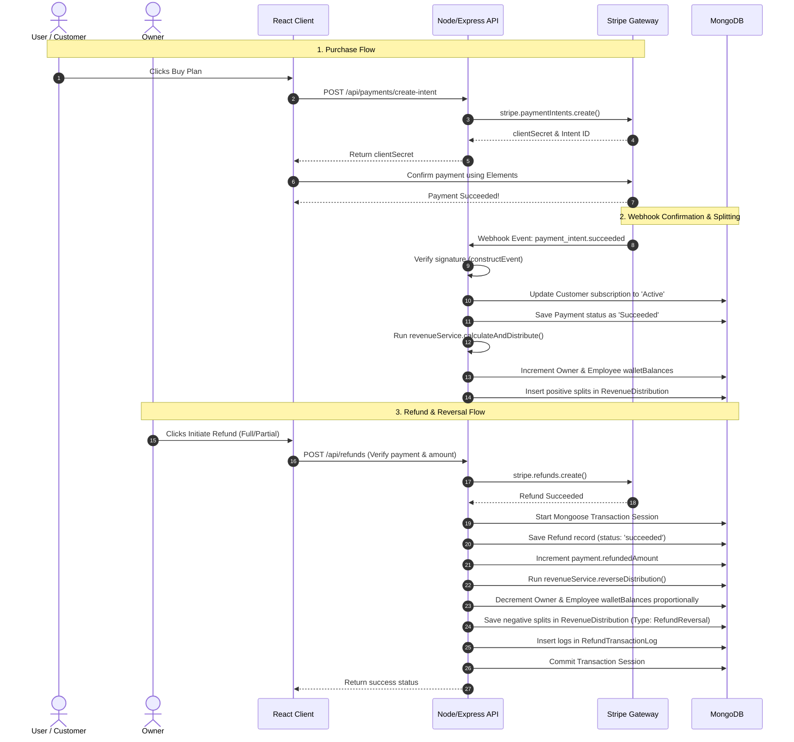

# SaaSFlow Project Architecture & System Flow Guide

This document details the purpose of the SaaSFlow application, the E2E lifecycle of transactions, the configuration rules of the revenue sharing engine, and a file-by-file overview of what happens inside the codebase.

---

## 🎯 What is SaaSFlow Made For?

**SaaSFlow** is a complete, production-ready SaaS billing, revenue-sharing, and refund auditing gateway built using the MERN stack. It solves three critical business operations:

1. **Dynamic Subscription Management**: Customers subscribe to tiered plans (monthly/yearly), converting dynamically between USD prices and local INR amounts.

2. **Automated Revenue Distribution**: Whenever a customer pays, the system automatically splits that payment among the **Owner** and **Employees** in real-time according to settings stored in MongoDB (Equal Split or Percentage Split).

3. **Audited Stripe Refunds**: Supports full or partial refunds directly integrated with Stripe. Refunds reverse wallet distributions proportionally, record historical transaction logs, and utilize MongoDB transactions to guarantee financial consistency.

---

## 🔄 E2E System Flow

Below is the workflow showing what happens when a subscription purchase or refund occurs:

---

## 📁 File-by-File Breakdown

Here is an architectural map of what happens inside every backend and frontend file.

### 1. Backend Codebase (`/backend`)

#### Core Mounts
- **[server.js](file:///c:/Users/Asus/OneDrive/Desktop/StripeGateway/backend/server.js)**: Initializes the Express application. Configures cookie parsing, body parsing, and CORS. Mounts the raw-body webhook listener *before* Express JSON middleware to preserve raw buffers for Stripe signature verification. Mounts api route modules and the global error handler.

#### Database Configurations
- **[config/db.js](file:///c:/Users/Asus/OneDrive/Desktop/StripeGateway/backend/config/db.js)**: Establishes the connection between Mongoose and MongoDB. Sets up default event logs for database connections.

#### Database Models (`/backend/models`)
- **[models/User.js](file:///c:/Users/Asus/OneDrive/Desktop/StripeGateway/backend/models/User.js)**: Defines the User schema. Stores name, email, encrypted password, role (`User`, `Employee`, `Owner`, `Admin`), current wallet balance, and active subscription details. Includes pre-save hooks to hash passwords using bcrypt.
- **[models/Plan.js](file:///c:/Users/Asus/OneDrive/Desktop/StripeGateway/backend/models/Plan.js)**: Defines the subscription plans schema. Stores plan name, description, monthly price, and yearly price in USD.
- **[models/Payment.js](file:///c:/Users/Asus/OneDrive/Desktop/StripeGateway/backend/models/Payment.js)**: Logs customer payments. Stores plan references, purchase amounts in INR, payment status (`Succeeded`, `Failed`), refund statuses (`None`, `Partial`, `Full`), and Stripe payment intent IDs.
- **[models/WebhookLog.js](file:///c:/Users/Asus/OneDrive/Desktop/StripeGateway/backend/models/WebhookLog.js)**: Audits received Stripe Webhook event IDs to ensure idempotent, single-execution processing of payments and avoid duplicate splits.
- **[models/RevenueSettings.js](file:///c:/Users/Asus/OneDrive/Desktop/StripeGateway/backend/models/RevenueSettings.js)**: Stores global split modes (`Equal` or `Percentage`) and configuration variables like the Owner's target percentage.
- **[models/RevenueDistribution.js](file:///c:/Users/Asus/OneDrive/Desktop/StripeGateway/backend/models/RevenueDistribution.js)**: The ledger for wallet changes. Stores distribution amount, split mode, split percentages, transaction type (`Distribution` or `RefundReversal`), and an array of user splits detailing who received what amount.
- **[models/Refund.js](file:///c:/Users/Asus/OneDrive/Desktop/StripeGateway/backend/models/Refund.js)**: Logs active refunds. Tracks the parent payment, Stripe Refund ID, refund amount, type (`Full` or `Partial`), refund reason, status (`succeeded`, `failed`, `pending`), and the affected employees.
- **[models/RefundTransactionLog.js](file:///c:/Users/Asus/OneDrive/Desktop/StripeGateway/backend/models/RefundTransactionLog.js)**: Stores granular records auditing individual wallet reversal subtractions (type `'OwnerReversal'` or `'EmployeeReversal'`).

#### Middleware Layer (`/backend/middleware`)
- **[middleware/authMiddleware.js](file:///c:/Users/Asus/OneDrive/Desktop/StripeGateway/backend/middleware/authMiddleware.js)**: Implements authentication protection. Pulls JWT tokens from HTTP-only cookies, decrypts them, and verifies roles before routing traffic.
- **[middleware/asyncHandler.js](file:///c:/Users/Asus/OneDrive/Desktop/StripeGateway/backend/middleware/asyncHandler.js)**: Express wrapper that catches uncaught exceptions inside routes and forwards them to the global error middleware to avoid server crashes.
- **[middleware/errorHandler.js](file:///c:/Users/Asus/OneDrive/Desktop/StripeGateway/backend/middleware/errorHandler.js)**: Central error formatter. Maps Mongoose validation issues, duplicate keys, and authorization errors to clear client-facing JSON.
- **[middleware/validation.js](file:///c:/Users/Asus/OneDrive/Desktop/StripeGateway/backend/middleware/validation.js)**: Formulates inputs validation gates (like checking emails are formatted correctly, password lengths, etc.) using `express-validator`.

#### Business Logic Services (`/backend/services`)
- **[services/authService.js](file:///c:/Users/Asus/OneDrive/Desktop/StripeGateway/backend/services/authService.js)**: Manages authentication. Implements user signups, credentials validation, and security tokens creation.
- **[services/userService.js](file:///c:/Users/Asus/OneDrive/Desktop/StripeGateway/backend/services/userService.js)**: Accesses user details, lists employees, and reads custom wallet parameters.
- **[services/planService.js](file:///c:/Users/Asus/OneDrive/Desktop/StripeGateway/backend/services/planService.js)**: Manages subscription plan CRUD operations.
- **[services/paymentService.js](file:///c:/Users/Asus/OneDrive/Desktop/StripeGateway/backend/services/paymentService.js)**: Orchestrates checkout payments:
  - `generatePaymentIntent`: Calculates USD conversion to INR paise (1 USD = 80 INR) and returns the Stripe checkout client secret.
  - `processWebhookEvent`: Decodes checked Stripe signatures, registers payment records, and executes splits. Listens to `charge.refunded` and `refund.updated` events, processing wallet reversals *only* if Stripe refund status is `'succeeded'`.
  - `queryPaymentHistory`: Paginated list retrieval. Admins and Owners can fetch all records; Customers can only fetch their own.
- **[services/revenueService.js](file:///c:/Users/Asus/OneDrive/Desktop/StripeGateway/backend/services/revenueService.js)**: The revenue sharing calculator:
  - `calculateAndDistribute`: Dynamically splits invoice sums according to split modes, updates user wallets, and logs splits.
  - `reverseDistribution`: Scales wallet subtractions proportionally during refunds using transactional sessions to prevent math corruption. Logs entries in `RefundTransactionLog`.
  - `getWalletStats`: Computes total available balances, history lists, and returns role-based lifetime revenue (Owner sees gross earnings before refunds, Employee sees net earnings).

#### Controllers and Routers (`/backend/controllers` & `/backend/routes`)
- **Controllers** handle HTTP parameters mapping, calling business functions inside `services`, and outputting JSON:
  - `authController.js` / `authRoutes.js`
  - `userController.js` / `userRoutes.js`
  - `planController.js` / `planRoutes.js`
  - `paymentController.js` / `paymentRoutes.js`
  - `revenueController.js` / `revenueRoutes.js`
  - `refundController.js` / `refundRoutes.js` (Manages refund validation checks: duplicate request filters, Stripe status validation, and transactional MongoDB commits).

---

## frontend React Codebase (`/frontend/src`)

#### Boot Mounts
- **[main.jsx](file:///c:/Users/Asus/OneDrive/Desktop/StripeGateway/frontend/src/main.jsx)**: Starts the React Virtual DOM, loads base styles, and wraps the tree.
- **[App.jsx](file:///c:/Users/Asus/OneDrive/Desktop/StripeGateway/frontend/src/App.jsx)**: Lists router setups. Enforces login and checks role access levels using ProtectedRoute wrappers.
- **[index.css](file:///c:/Users/Asus/OneDrive/Desktop/StripeGateway/frontend/src/index.css)**: Implements base Tailwind configuration.

#### Shared Modules (`/frontend/src/components` & `/frontend/src/context`)
- **[context/AuthContext.jsx](file:///c:/Users/Asus/OneDrive/Desktop/StripeGateway/frontend/src/context/AuthContext.jsx)**: Stores active user information and session login state, providing auth properties universally to React nodes.
- **[services/api.js](file:///c:/Users/Asus/OneDrive/Desktop/StripeGateway/frontend/src/services/api.js)**: Configures Axios instances, routing requests automatically to `http://localhost:5000/api` with credentials setup.
- **[components/Navbar.jsx](file:///c:/Users/Asus/OneDrive/Desktop/StripeGateway/frontend/src/components/Navbar.jsx)**: Implements the premium navigation bar, adapting menu options based on roles.
- **[components/ProtectedRoute.jsx](file:///c:/Users/Asus/OneDrive/Desktop/StripeGateway/frontend/src/components/ProtectedRoute.jsx)**: Blocks navigation, redirecting unauthenticated users to `/login`.
- **[components/CheckoutForm.jsx](file:///c:/Users/Asus/OneDrive/Desktop/StripeGateway/frontend/src/components/CheckoutForm.jsx)**: Embedded Stripe payment input form handling credit card logic.

#### React Pages (`/frontend/src/pages`)
- **[pages/Login.jsx](file:///c:/Users/Asus/OneDrive/Desktop/StripeGateway/frontend/src/pages/Login.jsx)** / **[pages/Signup.jsx](file:///c:/Users/Asus/OneDrive/Desktop/StripeGateway/frontend/src/pages/Signup.jsx)**: Form pages handling credentials submission.
- **[pages/Profile.jsx](file:///c:/Users/Asus/OneDrive/Desktop/StripeGateway/frontend/src/pages/Profile.jsx)**: Renders user profile information, payment plans, and subscription states.
- **[pages/Checkout.jsx](file:///c:/Users/Asus/OneDrive/Desktop/StripeGateway/frontend/src/pages/Checkout.jsx)**: Loads Stripe Elements contexts dynamically to authorize new payment intents.
- **[pages/ManagePlans.jsx](file:///c:/Users/Asus/OneDrive/Desktop/StripeGateway/frontend/src/pages/ManagePlans.jsx)**: CRUD interface allowing Admins to edit subscription plans.
- **[pages/AdminDashboard.jsx](file:///c:/Users/Asus/OneDrive/Desktop/StripeGateway/frontend/src/pages/AdminDashboard.jsx)**: Dashboard showing analytical charts, subscription statistics, and active users counts.
- **[pages/RevenueDashboard.jsx](file:///c:/Users/Asus/OneDrive/Desktop/StripeGateway/frontend/src/pages/RevenueDashboard.jsx)**: Displays available balance cards, lifetime earnings, and transaction lists:
  - Owners configure Equal vs Percentage splits settings.
  - Employees view their split allocations.
  - Both view audit logs of **Refund Reversal Wallet Logs** displaying refund deduction details.
- **[pages/RefundsManagement.jsx](file:///c:/Users/Asus/OneDrive/Desktop/StripeGateway/frontend/src/pages/RefundsManagement.jsx)**: Owner workspace for issuing refunds:
  - Statistics cards displaying total refunded values, count logs, and in-flight states.
  - Filters to search by date, amount, user, or status.
  - Modal workflows to initiate full/partial refunds and view estimated wallet split reversals before confirming.
- **[pages/PaymentsList.jsx](file:///c:/Users/Asus/OneDrive/Desktop/StripeGateway/frontend/src/pages/PaymentsList.jsx)**: Lists general billing history. Clicking on any entry redirects the user to details.
- **[pages/PaymentDetails.jsx](file:///c:/Users/Asus/OneDrive/Desktop/StripeGateway/frontend/src/pages/PaymentDetails.jsx)**: Comprehensive receipt:
  - Displays original payment plan, charge amount, customer metadata.
  - Shows original revenue split distributions breakdown.
  - Displays prominent warnings showing remaining refundable balance if the invoice is partially refunded.
  - Shows refund logs containing Stripe Refund IDs and reason details.
