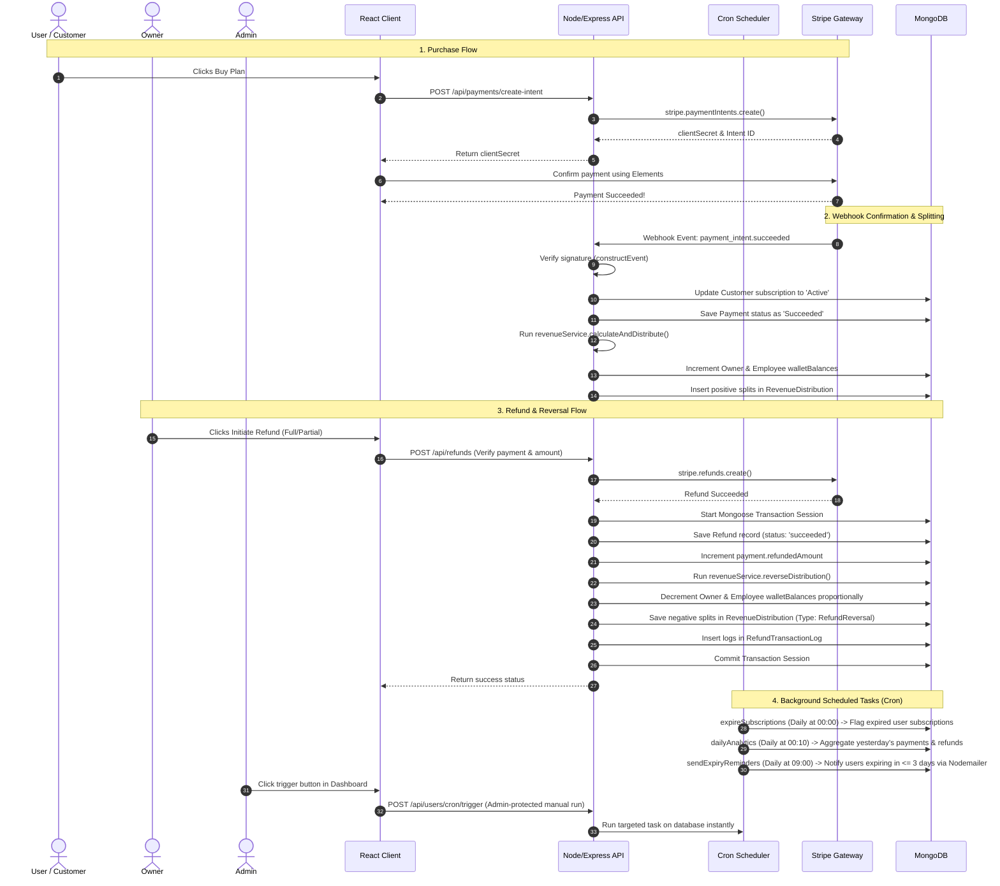

# SaaSFlow Project Architecture & System Flow Guide

This document details the purpose of the SaaSFlow application, the E2E lifecycle of transactions, the configuration rules of the revenue sharing engine, and a file-by-file overview of what happens inside the codebase.

---

## 🎯 What is SaaSFlow Made For?

**SaaSFlow** is a complete, production-ready SaaS billing, revenue-sharing, and refund auditing gateway built using the MERN stack. It solves four critical business operations:

1. **Dynamic Subscription Management**: Customers subscribe to tiered plans (monthly/yearly), converting dynamically between USD prices and local INR amounts.
2. **Automated Revenue Distribution**: Whenever a customer pays, the system automatically splits that payment among the **Owner** and **Employees** in real-time according to settings stored in MongoDB (Equal Split or Percentage Split).
3. **Audited Stripe Refunds**: Supports full or partial refunds directly integrated with Stripe. Refunds reverse wallet distributions proportionally, record historical transaction logs, and utilize MongoDB transactions to guarantee financial consistency.
4. **Automated Maintenance Scheduler**: Periodically triggers automated subscription expiration checks, compiles daily financial analytics reports, and dispatches renewal warning notifications.

---

## 🔄 E2E System Flow

Below is the workflow showing what happens when a subscription purchase, refund, or background scheduling check occurs:

---

## 📁 File-by-File Breakdown

Here is an architectural map of what happens inside every backend and frontend file.

### 1. Backend Codebase (`/backend`)

#### Core Setup & Boot
- **[server.js](file:///c:/Users/Asus/OneDrive/Desktop/StripeGateway/backend/server.js)**: Initializes the Express application. Configures cookie parsing, body parsing, and CORS. Mounts raw-body webhook listener first to preserve Stripe signature buffers. Initializes the background cron task scheduler and mounts API routers.

#### Database Configurations
- **[config/db.js](file:///c:/Users/Asus/OneDrive/Desktop/StripeGateway/backend/config/db.js)**: Establishes the connection between Mongoose and MongoDB.

#### Database Models (`/backend/models`)
- **[models/User.js](file:///c:/Users/Asus/OneDrive/Desktop/StripeGateway/backend/models/User.js)**: Defines the User schema. Stores credentials, role (`User`, `Employee`, `Owner`, `Admin`), current wallet balance, and active subscription details. Also includes cron-specific flags: `expiresAt` (Date), `subscriptionStatus` (String), `isPremium` (Boolean), and `reminderSent` (Boolean).
- **[models/Plan.js](file:///c:/Users/Asus/OneDrive/Desktop/StripeGateway/backend/models/Plan.js)**: Defines subscription plans. Stores monthly and yearly prices in USD.
- **[models/Payment.js](file:///c:/Users/Asus/OneDrive/Desktop/StripeGateway/backend/models/Payment.js)**: Logs customer payments. Stores amounts in INR, payment status (`Succeeded`, `Failed`), refund status, and Stripe Payment Intent IDs.
- **[models/WebhookLog.js](file:///c:/Users/Asus/OneDrive/Desktop/StripeGateway/backend/models/WebhookLog.js)**: Logs webhook request IDs to prevent duplicate split execution.
- **[models/RevenueSettings.js](file:///c:/Users/Asus/OneDrive/Desktop/StripeGateway/backend/models/RevenueSettings.js)**: Configures global splits settings (Equal vs Percentage Split modes).
- **[models/RevenueDistribution.js](file:///c:/Users/Asus/OneDrive/Desktop/StripeGateway/backend/models/RevenueDistribution.js)**: The wallet transaction ledger. Records distributions or refund reversals.
- **[models/Refund.js](file:///c:/Users/Asus/OneDrive/Desktop/StripeGateway/backend/models/Refund.js)**: Tracks parent payment reference, Stripe Refund ID, refund amount, status, and affected employees.
- **[models/RefundTransactionLog.js](file:///c:/Users/Asus/OneDrive/Desktop/StripeGateway/backend/models/RefundTransactionLog.js)**: Logs reversal subtractions from wallets to guarantee database consistency.
- **[models/DailyAnalytics.js](file:///c:/Users/Asus/OneDrive/Desktop/StripeGateway/backend/models/DailyAnalytics.js) [NEW]**: Logs aggregated daily metrics (successful payment totals, refunds, net revenue, active premium user counts) for date-based history tracking.

#### Background Cron Jobs scheduler (`/backend/cron`)
- **[cron/expireSubscriptions.js](file:///c:/Users/Asus/OneDrive/Desktop/StripeGateway/backend/cron/expireSubscriptions.js) [NEW]**: Finds users whose `expiresAt` has passed and sets their subscriptionStatus to `Expired` and `isPremium` to `false`.
- **[cron/dailyAnalytics.js](file:///c:/Users/Asus/OneDrive/Desktop/StripeGateway/backend/cron/dailyAnalytics.js) [NEW]**: Compiles and records payments, refunds, and active user metrics for the previous calendar day, saving logs in `DailyAnalytics`.
- **[cron/sendExpiryReminders.js](file:///c:/Users/Asus/OneDrive/Desktop/StripeGateway/backend/cron/sendExpiryReminders.js) [NEW]**: Dispatches warning alerts via email using nodemailer to accounts scheduled to expire within the next 3 days.
- **[cron/index.js](file:///c:/Users/Asus/OneDrive/Desktop/StripeGateway/backend/cron/index.js) [NEW]**: Coordinates and schedules the cron tasks using standard cron intervals, enforcing the `ENABLE_CRON` env variable check.

#### System Utilities
- **[utils/sendEmail.js](file:///c:/Users/Asus/OneDrive/Desktop/StripeGateway/backend/utils/sendEmail.js) [NEW]**: Helper service that reads SMTP configurations from the environment and dispatches transactional emails.

#### Controllers and Routers (`/backend/controllers` & `/backend/routes`)
- **`authController.js` / `authRoutes.js`**: Signup, Login, Profile loading, and JWT session handling.
- **`userController.js` / `userRoutes.js`**: User listings, role updates, and the secure admin trigger endpoint `POST /api/users/cron/trigger` to manually execute schedulers.
- **`planController.js` / `planRoutes.js`**: Subscription plan modifications.
- **`paymentController.js` / `paymentRoutes.js`**: Checkout intents, webhook reception, and history listings.
- **`revenueController.js` / `revenueRoutes.js`**: Splits configurations, configuration changes, and active wallet balance summaries.
- **`refundController.js` / `refundRoutes.js`**: Audits, initiates, and reverses Stripe payment distributions.

---

### 2. Frontend React Codebase (`/frontend/src`)

#### Boot Mounts
- **[main.jsx](file:///c:/Users/Asus/OneDrive/Desktop/StripeGateway/frontend/src/main.jsx)**: Bootstraps the React DOM and attaches root elements.
- **[App.jsx](file:///c:/Users/Asus/OneDrive/Desktop/StripeGateway/frontend/src/App.jsx)**: Registers react routes, applying `ProtectedRoute` gates to keep workspace directories safe.
- **[index.css](file:///c:/Users/Asus/OneDrive/Desktop/StripeGateway/frontend/src/index.css)**: Implements base Tailwind utility styles.

#### Shared Services & Contexts
- **[context/AuthContext.jsx](file:///c:/Users/Asus/OneDrive/Desktop/StripeGateway/frontend/src/context/AuthContext.jsx)**: Global provider wrapping user authorization states.
- **[services/api.js](file:///c:/Users/Asus/OneDrive/Desktop/StripeGateway/frontend/src/services/api.js)**: Axios configuration. Dynamically detects if the application is running locally (`localhost`) and automatically redirects requests to `http://localhost:5000/api`, falling back to Render production endpoints otherwise.

#### Components
- **[components/Navbar.jsx](file:///c:/Users/Asus/OneDrive/Desktop/StripeGateway/frontend/src/components/Navbar.jsx)**: Global navigation bar. Features a collapsible slide-in drawer sidebar on mobile screens with backdrop overlays.
- **[components/CheckoutForm.jsx](file:///c:/Users/Asus/OneDrive/Desktop/StripeGateway/frontend/src/components/CheckoutForm.jsx)**: Embedded Stripe card fields form handling billing submissions.

#### React Pages (`/frontend/src/pages`)
- **[pages/Login.jsx](file:///c:/Users/Asus/OneDrive/Desktop/StripeGateway/frontend/src/pages/Login.jsx) / [pages/Signup.jsx](file:///c:/Users/Asus/OneDrive/Desktop/StripeGateway/frontend/src/pages/Signup.jsx)**: Credentials forms wrapped in responsive page margins.
- **[pages/AdminPanel.jsx](file:///c:/Users/Asus/OneDrive/Desktop/StripeGateway/frontend/src/pages/AdminPanel.jsx)**: User administration center. Converts table elements to stacked layout cards on mobile. Includes the **System Cron Scheduler Controls** dashboard panel to run cron tasks instantly.
- **[pages/AdminDashboard.jsx](file:///c:/Users/Asus/OneDrive/Desktop/StripeGateway/frontend/src/pages/AdminDashboard.jsx)**: Displays graphs and charts with scrolling overflow containers.
- **[pages/ManagePlans.jsx](file:///c:/Users/Asus/OneDrive/Desktop/StripeGateway/frontend/src/pages/ManagePlans.jsx)**: Subscription plan editors wrapped in responsive modals.
- **[pages/PaymentsList.jsx](file:///c:/Users/Asus/OneDrive/Desktop/StripeGateway/frontend/src/pages/PaymentsList.jsx)**: Transaction logs converting to stacked cards on narrow mobile viewports.
- **[pages/PaymentDetails.jsx](file:///c:/Users/Asus/OneDrive/Desktop/StripeGateway/frontend/src/pages/PaymentDetails.jsx)**: Details receipt displaying revenue splits, remaining refundable balances, and refund audit details.
- **[pages/RefundsManagement.jsx](file:///c:/Users/Asus/OneDrive/Desktop/StripeGateway/frontend/src/pages/RefundsManagement.jsx)**: Platform refund manager showing refund statistics cards and request trigger forms.
- **[pages/RevenueDashboard.jsx](file:///c:/Users/Asus/OneDrive/Desktop/StripeGateway/frontend/src/pages/RevenueDashboard.jsx)**: Shows available wallet balances and wallet change history logs.
